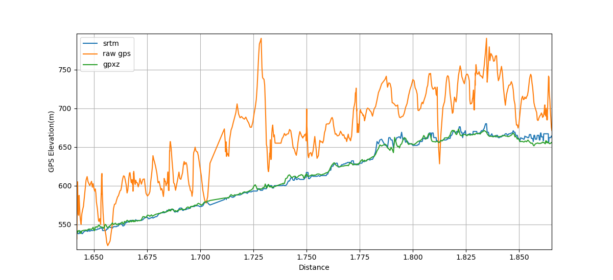

# trktogpx
trktogpx converts data recorded by a mapjack moveiq GPS Tracker in `.trk` format (at least it claims to be, but the files do not get recognized by any converter tools) to standard `.gpx`. You first have to download the recordings using the MoveIQ App, but since the official website doesn't exist anymore the only working Download I found is [here](https://de.elv.com/mapjack-move-iq-gps-datenlogger-094679). Note that all recordings will be stored in the same `.trk` file.

## Installation
[First of all, you need to install python.](https://www.python.org/downloads/)
Then upgrade **pip** and install the required packages:
```
pip install --upgrade pip
pip install -r requirements.txt
```

## CLI
The following command will convert your file `input.trk` to `.gpx` and split the recordings into **TrackSegments**.
```
python converter.py input.trk
```

In addition, it is possible to use `.gpx` files as input if functions such as time or altitude correction are to be applied to individual sections only.

### Adjust Split Parameters:
- `--maxtime` the maximum amount of time between two trackpoints in `hh-mm`, default: `00-05`
- `--maxdistance` the maximum distance, in _degree_, default: `0.5`


You can also save all **TrackSegments** to separate files with `--separate` or `-s`.
If you want all points in a single **TrackSegment** use `--dontsplit`.

### Specify output
```
python converter.py input.trk -o output
```
without .gpx

### Time Correction
Although my moveiQ is set to the correct date, the timestamps start in **1988**, which is obviously wrong. To correct this, use `--time` or just `-t` with `yyyy-mm-dd-hh-mm-ss`. Second is optional.
```
python converter.py input.trk -t 2022-08-23-18-56-13
```
If you intend to geotag pictures, sync the track to your camera clock with `--sync gpstime cameratime`

```
python converter.py input.trk -t 2022-08-23-18-56-13 --sync 2022-08-23-19-12-28 2022-08-23-19-13-14
```

## Elevation Correction
Since the recorded height is often inaccurate, its common to add or replace it retroactive.

### SRTM
Data from the [Shuttle-Radar-Topography-Mission](wikipedia.org/wiki/Shuttle_Radar_Topography_Mission) can be used via the `--srtm` command. You can set the cache directory in the `.env` file
### GPXZ
[GPXZ.io](https://www.gpxz.io/) provides higher-resolution and smoother elevation data, but you need to create an _API-Key_.
Add this key to the `.env` file and adjust the `GPXZ_BATCH_SIZE` according to your plan (**50** for the free plan). Once this is set up you can use it with `--gpxz`.

## Credits
- creating the gpx file: [tkrajina/gpxpy](https://github.com/tkrajina/gpxpy)
- querying srtm data: [tkrajina/SRTM.py](https://github.com/tkrajina/srtm.py)
- gpxz data: [GPXZ.io](https://www.gpxz.io/)